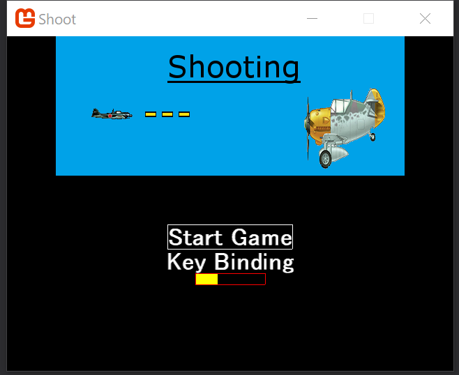
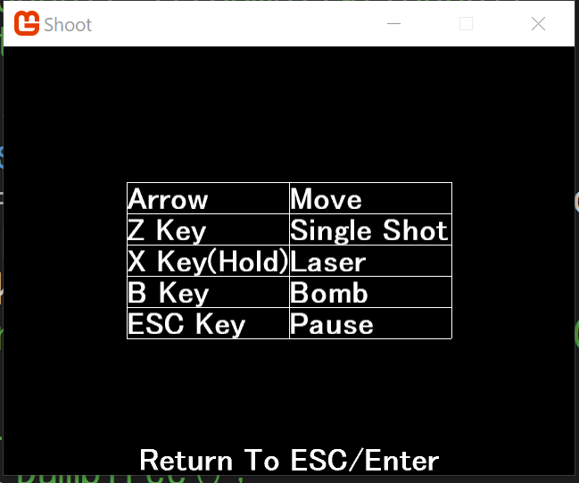
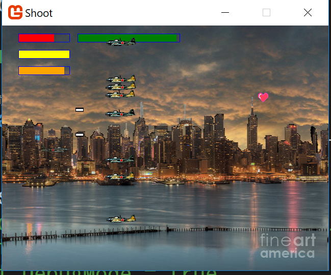
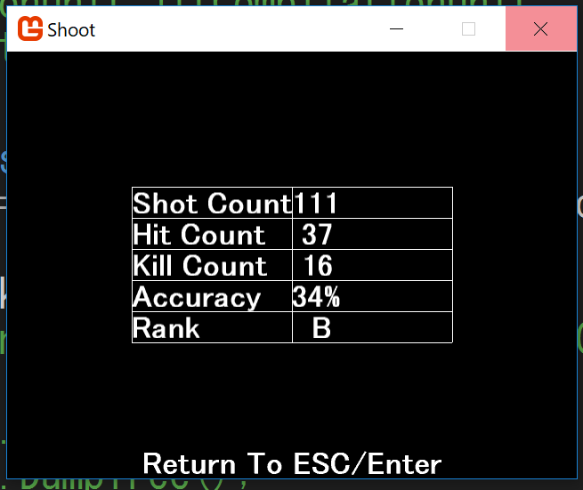

# Shooting
Shootingは自作の2Dゲームです。  
* 言語 C#  
* ライブラリ Xna

# 概要
横方向のシューティングです。  
画面右から迫るエネミーを撃破するのが目的です。  
ウェーブをクリアするとボスが現れます。  
ゲームオーバーになるまで続きます。　
# スクリーンショット
## タイトル

## 操作方法

## プレイ

## プレイ2
赤が体力  
黄色が残弾  
オレンジがボム  
緑が防衛ゲージ(敵が画面左に到達すると減っていく)  

## リザルト
